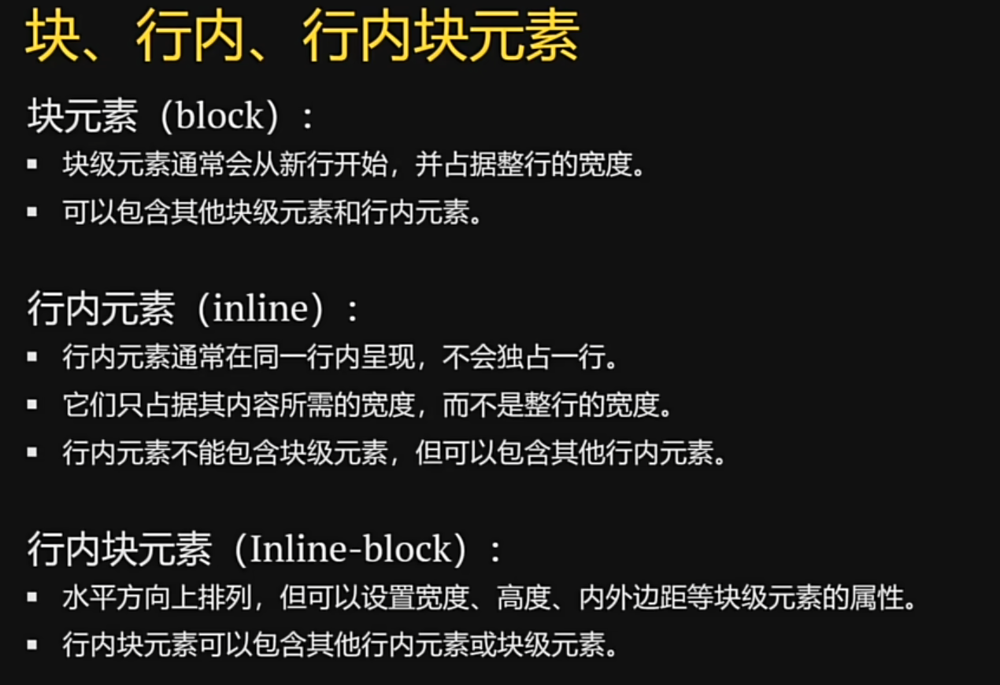
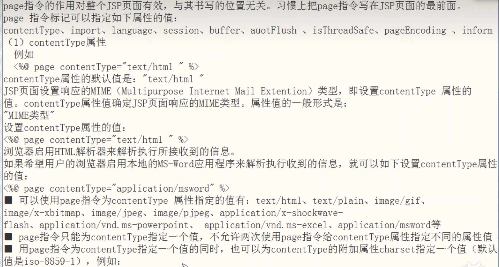

### 技巧

.nav    创建class类
#nav    创建id

   块类

    下划线
  没有特殊标记的a标签
     换行<b> 加粗   
文本
<form>   表单

CSS
装修 
style
. (class)    # (id)    * (all)

### JSP操作指南
<%@   %>

<%!  %>  声明变量,定义方法
在全局都有效

<%   %>Java程序片  :局部变量,调用方法输入输出

HTML注释           JSP注释
<!--  -->          <%--    --%>

指令标记
page     include
<%@ page contentType="text/html;charset=utf-8" language="java" %>

page pageEncoding="utf-8"

tag标记
<%@ taglib tagdir="标记库的位置" prefix="前缀">
<computer:oddNumberSum>
 
 tag指令attribute
 <%@ attribute name="对象的名字" required="true"|"false" type="对象的类型">
 