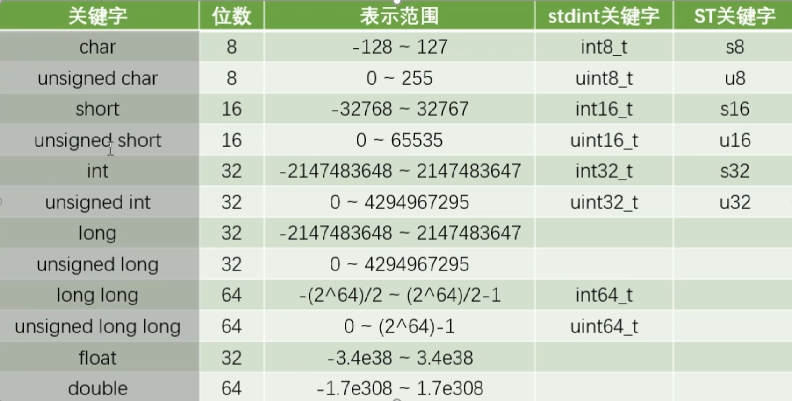
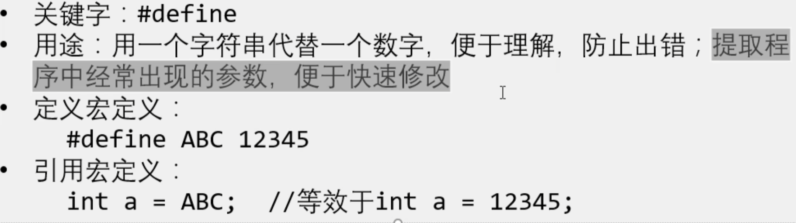
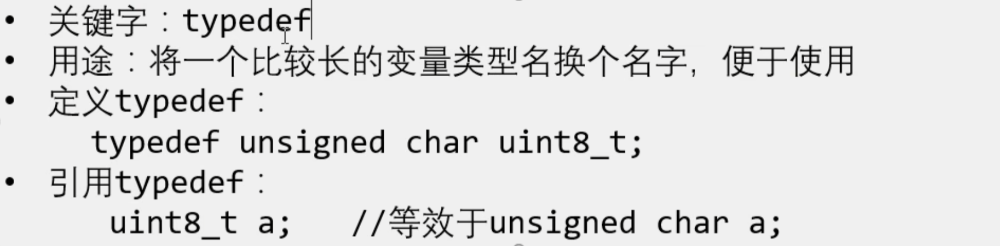
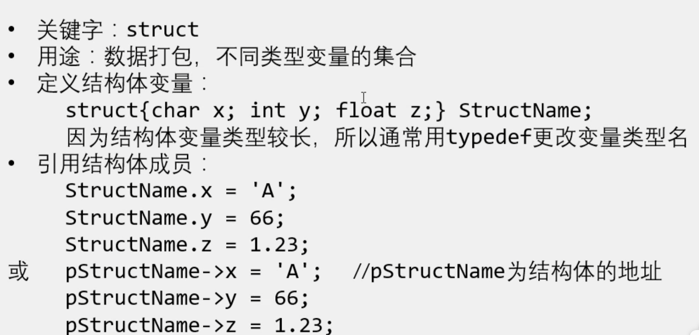
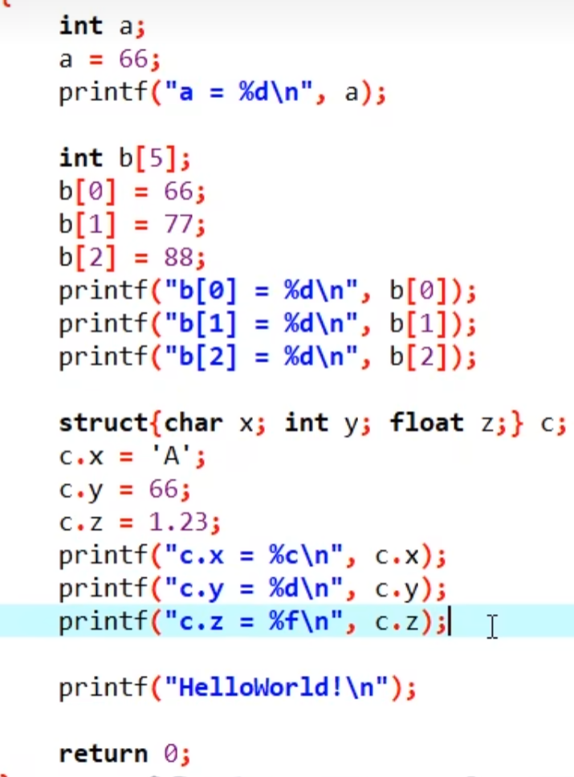
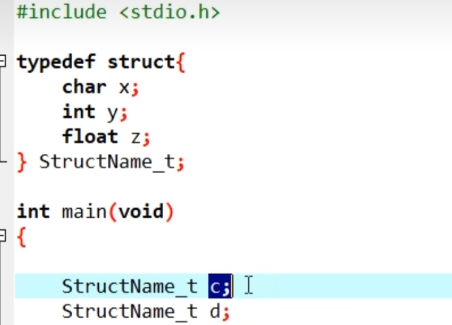
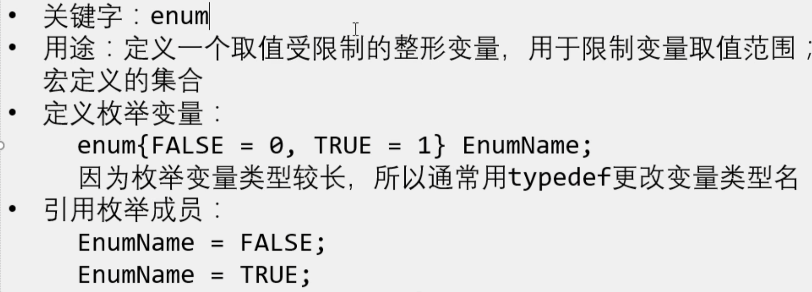

#### 

运算放大器   51 AD/DA

uint8_t = unsigned char    uint16_t = unsigned short

####  宏定义  typedef   结构体  枚举

typedef:

结构体:

typedef和结构体的结合

枚举

#### GPIO输入
Ctrl+Alt+空格  代码提示
<!-- GPIO不管是输入还是输出都是对于单片机而言 ,操作流程是:开启时钟,定义结构体 (输入输出模式,引脚,输出速度)GPIO_Init将指定的GPIO外设初始化好
重要的是模块的封装,每个模块硬件可以使用一个单独的.h.c文件封装,这个可以分配给任何人完成团队的合作-->

#### 外部中断(外部驱动,突发)
例子(旋转编码器)

NVIC  (内核外设)

AFIO_EXTI   中断选择器判断选择何种中断
AFIO主要用于引脚复用功能的选择和重定义
在STM32中主要完成两个任务:复用功能引脚重映射,中断引脚选择

EXTI

与  平的  像操场的一边
或  两边弯弯的
非  三角+圈
配置RCC  GPIO(选择输入模式) AFIO(选择这一路的GPIO//中断引脚选择) EXTI(上升沿,下降沿//边沿检测及控制,中断响应或事件响应) NVIC(优先级//其他外设)

GPIO_PinRemapConfig  重映射 第一个参数可以选择重映射的方式,第二俄国参数是新的状态
GPIO_EXTILineConfig  配置AFIO的数据选择器,选择我们想要的中断引脚  AFIO中断引脚选择

#### TIM定时中断

1.RCC开启始终,,2.选择时基单元的时钟源,,3.配置时基单元,,4.配置中断控制,允许更新中断到NVIC,,5.配置NVIC在NVIC中打开定时器中断的通道,并分配一个优先级

