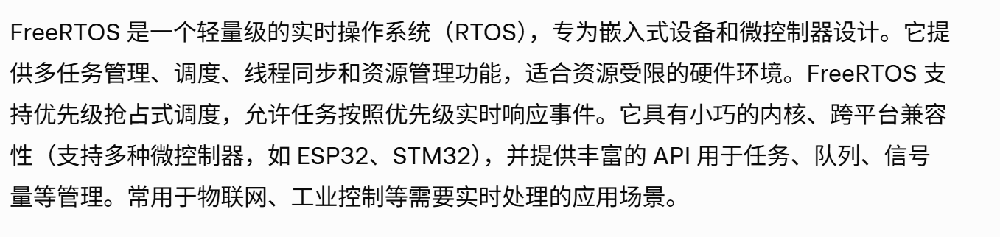
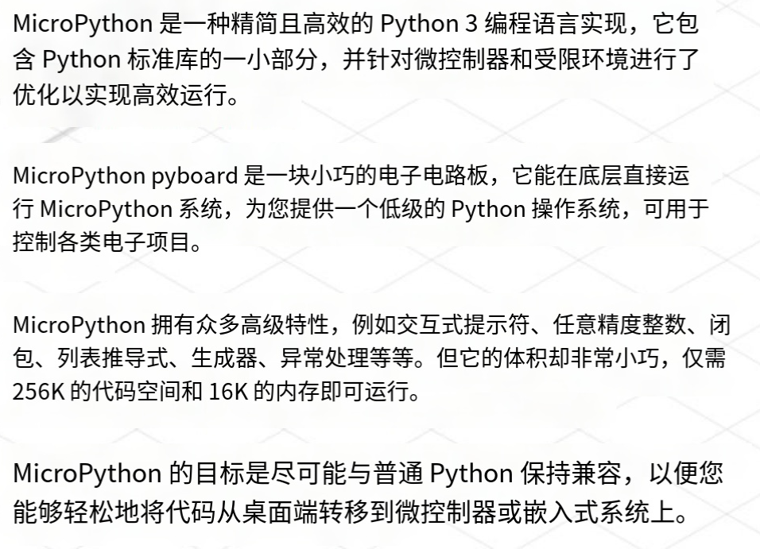
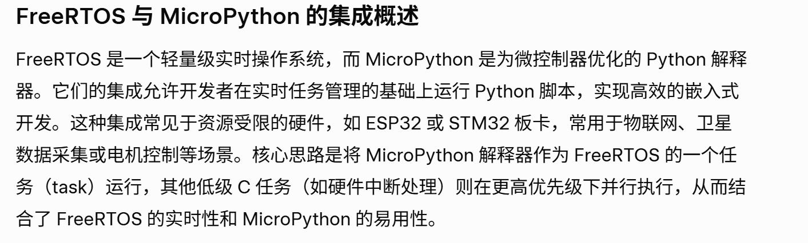

## 物联网学习路线
>
>简介：物联网项目的技术栈涉及硬件、软件、通信协议、数据处理，通过互联网将物理设备、传感器、执行器等连接起来，实现设备间的通信、数据采集与共享的网络系统。

### 一 该掌握的技术（粗略）

```
开发板与微控制器，传感器与执行器，嵌入式系统

通信协议，数据采集和处理，云平台
```

### 二 具体内容

#### 1.开发板和微控制器

- 平台：Arduino、Raspberry Pi、ESP32/ESP8266、STM32、NodeMCU
- 硬件选型、GPIO操作、电路设计基础(PCB设计)
- 所需工具/IDE：VSCODE上插件Platform/PlatformIO；Arduino IDE；Keil uVision；
- 传感器模块：温湿度，光线传感器等，
- 信号处理，传感器的信号采集
- 固件开发（FreeRTOS等）实时操作系统


#### 2.编程语言

- C/C++（用于Arduino、ESP32）Python ， MicroPython

MicroPython 简化开发，FreeRTOS 可以保证实时任务调度（如电机控制）



#### 3.通信协议

- 短距离：Wi-Fi，蓝牙（例如ESP32的网络模块和蓝牙模块），Zigbee
- 长距离：MQTT，HTTP等
- 工具：<u>Mosquitto（MQTT服务器）</u>、Wireshark（网络分析）

#### 4.工具与开发环境

- 硬件：Arduino IDE、PlatformIO、RaspberryPiOS
- 软件：VSCode、PyCharm 、可能会用上IDEA
- 版本控制：git

### 三 工作分配
