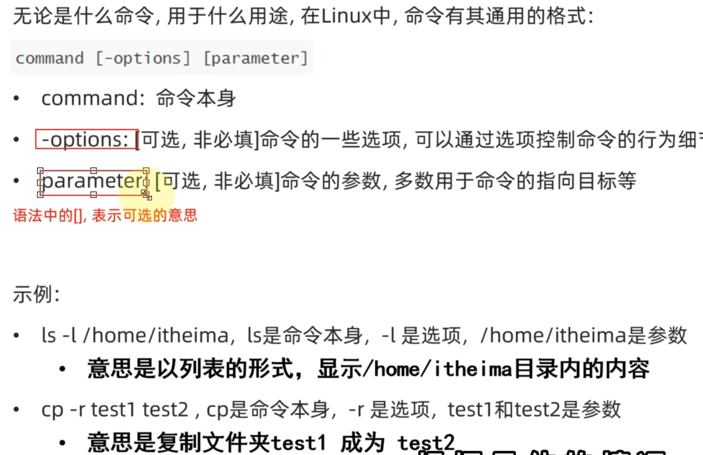
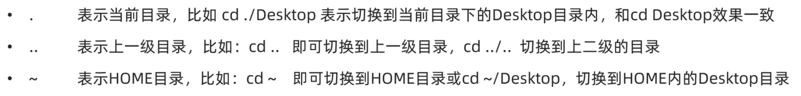

### 一 基本指令
ls   cd  pwd  
###### ls
ls  

optionalfeatures

ls  -a -l -h(需要和-l搭配使用)  列表  可以组合  顺序无所谓
###### cd

###### pwd   查看当前目录
###### mkdir  创建文件夹
-p:   mkdir -p itcast/good/666    一次创建多个层级
###### touch  创建文件   
touch text.txt
###### cat   查看文件内容   more 支持翻页,文件过多时使用
cat text.txt
